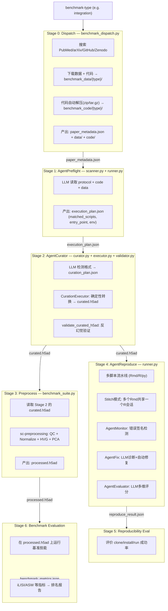

# EasyBench 多 Agent 架构设计方案

> 最后更新: 2026-07-05
> 状态: 开发中

---

## 0. 当前基线 (2026-07-05)

```
Stage 0 → benchmark_dispatch    (搜索 → 下载数据 → 代码自动解压)  ✅ 完成
Stage 1 → AgentPreflight        (LLM 配型 → execution_plan)       ✅ 完成
Stage 2 → AgentCurator          (LLM格式检测 → 转换 → 验证)       ✅ 完成
  ├─ run_agent_curator           LLM 格式检测 → curation_plan.json
  ├─ CurationExecutor            确定性 h5ad 转换
  └─ validate_curated_h5ad       反幻觉验证
Stage 3 → Process Data           (sc-preprocessing → QC+HVG+PCA)  ✅ 重构
Stage 4 → AgentReproduce        (多入口脚本 + Stitch + Fix)       ✅ 完成
  ├─ runner.py                   串联/独立执行 + Stitch模式
  ├─ monitor.py                  错误签名检测
  ├─ fix.py                      LLM诊断 + 自动安装
  ├─ extractor.py                knitr 输出解析
  └─ agent_evaluator.py           LLM多维评分
Stage 5 → Reproducibility Eval  (可复现性评分)                    ✅ 完成
Stage 6 → Benchmark Evaluation  (基准指标评测)                    ⚠️ 骨架
```

## 1. 架构总览：7 阶段 + 6 Agent 流水线


    
    subgraph S2["Stage 2: AgentReproduce 🆕"]
        RP["多脚本流水线 (Rmd→knit, .R→Rscript)"]
        MON["AgentMonitor: 15种错误签名检测"]
        FIX["AgentFix: 技能库+LLM诊断+自动修复"]
        EVAL["AgentEvaluator: LLM多维度评分"]
        EXTR["Extractor: knitr输出解析"]
        subgraph OUTPUTS["reproduce/ 产出"]
            M1["manifest.json (引用记录)"]
            M2["reproduce_result.json (评分+指标)"]
            M3["*.md (knitr完整输出)"]
            M4["fix_attempts.json (修复日志)"]
        end
    end
    
    subgraph S3["Stage 3: reproducibility_eval"]
        REPR["评价 clone/install/run 成功率"]
    end
    
    subgraph S4["Stage 4: benchmark_evaluation"]
        BENCH["在 processed.h5ad 上运行 skill"]
        RANK["iLISI/ASW 等指标 → 排名报告"]
    end
    
    S0 -->|paper_metadata.json| S05
    S05 -->|execution_plan.json| S1
    S1 -->|curated.h5ad| S2
    S1 -->|curated.h5ad| S4
    S2 -->|reproduce_result.json| S3
    S4 -->|benchmark_metrics.json| RANK
```

## 2. Agent 定义

| # | Agent | 阶段 | 文件 | 职责 |
|---|-------|------|------|------|
| 1 | **AgentScanner** | Stage 0.5 | `scanner.py`, `runner.py` | LLM 配型：protocol + code + data → execution_plan |
| 2 | **AgentCurator** | Stage 1 | `curator.py`, `curator_runner.py` | LLM 格式检测 + 转换策略生成 |
| 3 | **CurationExecutor** | Stage 1 | `executor.py` | 确定性执行：h5ad 格式转换 + h5ad→RDS桥 |
| 4 | **CuratorValidator** | Stage 1 | `validator.py` | 反幻觉验证：维度/稀疏度/cross-validation |
| 5 | **AgentMonitor** | Stage 2 | `monitor.py` | 15种错误签名检测 + 3轮重试递进 |
| 6 | **AgentFix** | Stage 2 | `fix.py` | 模式匹配 → LLM诊断 → 实际执行安装 |
| 7 | **AgentEvaluator** | Stage 2b | `agent_evaluator.py` | LLM驱动评分 + benchmark_type感知 |

### 2.1 AgentScanner — Stage 0.5 的 LLM 驱动配型引擎

**职责**：读取 protocol + 扫描 code + 扫描 data → 生成 `execution_plan.json`

```
输入:
  {paper_slug}/
    experimental_protocol.json   ← 论文实验步骤
    paper_metadata.json          ← GSE/SRA/Zenodo/GitHub IDs
    data/{gse_id}/               ← 数据文件列表（不读内容）
  benchmark_code/{paper_slug}/
    {repo}/README.md             ← 代码仓库入口
    {repo}/ 文件树               ← 脚本名列表

输出:
  execution_plan.json
    ├── status: "ready" | "data_missing" | "code_missing" | "blocked"
    ├── matched_data:     {GSE_id → {format, samples, cells}}
    ├── matched_scripts:  {script_name → {purpose, input, output}}
    ├── entry_point:      "bash run.sh --data data/GSE12345"
    ├── missing:          ["GSE67890 只有 metadata", "代码需要 R 4.3 但我们没有"]
    ├── env_guess:        {python: "3.10", R: "4.3", Seurat: "5.0"}
    └── confidence:       0-100
```

**LLM 调用策略**：只传轻量文本，不传大文件内容
- experimental_protocol.json（~3KB）
- 代码仓库的前 5 层文件树（不含文件内容）
- 代码仓库中 ≤3 个关键文件的摘要（README.md + 主脚本的前 200 行）
- data/ 下每个 GSE 目录的文件名列表（不含大小，避免 bias）

**Token 预算**：每篇论文 ≤ 6000 tokens 

### 2.2 AgentCurator — Stage 1 的 LLM 驱动数据整理引擎

**职责**：解决「数据格式千奇百怪」的硬编码死局。用 LLM 看懂每个 GSE 目录下的实际文件结构，生成标准化的转换脚本。

**为什么需要它？**

```
GEO/SRA 下载的数据可能是：
  论文 A: GSE186069/
          ├── GSMxxx_barcodes.tsv.gz
          ├── GSMxxx_features.tsv.gz
          └── GSMxxx_matrix.mtx.gz       ← 标准 10X 格式 ✅
  论文 B: GSE274171/
          ├── counts.txt.gz               ← bulk count，需要转置 ❓
  论文 C: GSE115098/
          ├── GSE115098_RAW.tar
          │   └── (解压后)
          │       └── filtered_feature_bc_matrix.h5  ← 10X h5 格式
  论文 D: PRJNA1402391/
          ├── metadata.json               ← SRA metadata only 💀
  论文 E: zenodo_17259745/
          ├── processed_seurat.rds        ← Seurat RDS，需要 R 转换 ❓
  论文 F: GSE292843/
          ├── GSE292843_series_matrix.txt.gz   ← GEO matrix 格式 ❓
```

硬编码规则无法覆盖所有情况。AgentCurator 让 LLM 逐个目录理解，然后生成 `curation_plan.json`。

**输入**（轻量，不读文件内容）：
```
{paper_slug}/
  experimental_protocol.json   ← 论文说它用的什么格式
  data/
    GSE186069/                  ← 文件列表
      barcodes.tsv.gz (2.3MB)
      features.tsv.gz (1.1MB)
      matrix.mtx.gz (22.5MB)
    GSE274171/
      counts.txt.gz (1.8MB)
    ...
```

**LLM 输出**：`curation_plan.json`

```json
{
  "paper": "allele-specific-crispr-...",
  "curated_at": "2026-06-22T...",
  "datasets": [
    {
      "id": "GSE274171",
      "detected_format": "bulk_count_matrix_txt_gz",
      "has_barcodes": false,
      "has_features": false,
      "needs_transpose": true,
      "protocol_expects": "bulk RNA-seq count matrix for DESeq2",
      "curation_steps": [
        {"tool": "gunzip", "args": "counts.txt.gz"},
        {"tool": "python", "args": "transpose_and_add_gene_symbols.py --input counts.txt --output curated.h5ad"}
      ],
      "output_format": "h5ad",
      "confidence": 85
    },
    {
      "id": "GSE255900",
      "detected_format": "bulk_count_matrix_txt_gz",
      "same_pattern_as": "GSE274171",
      "reuse_curation": "GSE274171"
    }
  ],
  "uncuratable": [
    {
      "id": "PRJNA1402391",
      "reason": "only metadata.json, no actual data files — needs manual FASTQ download"
    }
  ]
}
```

**Token 预算**：同一篇论文的多个 GSE 可以一次 LLM 调用处理（名单 + 协议放在一个 prompt 里），每篇 ~4K tokens

### 2.3 AgentMonitor — Stage 2 的外部监控 Agent（职责不变）

**职责**：在 `reproduce` 执行期间一直观察，检测死锁、超时、无限循环

```
输入:
  execution_plan.json           ← 期望的执行流程
  reproduce 的实时执行日志       ← shell stdout/stderr stream

输出:
  monitor_actions:
    - CONTINUE        → 一切正常，继续
    - WARN            → 有警告但不致命（如 "pip 警告：版本冲突"）
    - RETRY           → 失败但可重试（如 "网络超时"）
    - FALLBACK        → 当前路径不可行，切换到备选方案（如 "conda → Docker"）
    - ABORT           → 不可恢复，标记此论文为 "blocked"

死锁检测规则（硬编码 + LLM 辅助）:
  - 同一错误连续出现 ≥3 次             → RETRY → FALLBACK
  - 超过 30 分钟无输出                 → ABORT
  - pip install 失败（网络相关）        → RETRY（mirror 重试）
  - CUDA/GPU 不可用但代码不需要 GPU     → WARN（继续）
  - 内存不足 (OOM)                     → FALLBACK（减 batch size）
```

### 2.4 AgentFix — Stage 2 的故障修复 Agent（职责不变）

**职责**：被 AgentMonitor 触发后，诊断并修复可修复的错误

```
修复策略（检索优先于修复）:
  1. 匹配已知错误签名 → 从 fix_skill_library.json 中检索
  2. 如果匹配 → 执行预设修复
  3. 如果不匹配 → 调用 LLM 分析错误 + 建议修复方案

fix_skill_library.json 预设分类:
  {
    "pip_timeout":     "pip install --index-url https://mirrors.aliyun.com/pypi/simple/ ...",
    "conda_solve":     "conda install -c conda-forge --override-channels ...",
    "cuda_mismatch":   "conda install cudatoolkit=11.8 -c nvidia ...",
    "r_package_missing": "Rscript -e 'install.packages(\"BiocManager\"); BiocManager::install(\"{pkg}\")'",
    "path_hardcoded":  "sed -i 's|/original/path|/new/path|g' {file}",
    "h5ad_version":    "pip install anndata==0.8.0",
    "disk_full":       "[HUMAN_INTERVENTION] 磁盘不足",
    "permission":      "chmod +x {file} || [HUMAN_INTERVENTION]"
  }
```

---

## 3. 各阶段详细设计

### Stage 0: benchmark_dispatch
- **状态**: ✅ 完成
- **位置**: `skills/orchestrator/benchmark_dispatch/benchmark_dispatch.py`
- **功能**: 搜索 → 下载 → 生成 paper_metadata.json
- **输出目录**: `benchmark_data/{benchmark_type}_{output_name}/{paper_slug}/`
  - 例如 `benchmark_data/integration_e2e_test/autoinhibitory-feedback-.../`

### Stage 0.5: AgentScanner
- **状态**: ✅ 完成
- **位置**: `skills/agents/agent_preflight/scanner.py`, `runner.py`
- **功能**: LLM 读取 experimental_protocol.json + 扫描 data/ + code/ → execution_plan.json
- **关键产出**: matched_data, matched_scripts, entry_point, env_guess
- **增强**: scanner.py 新增 `script_list` → LLM 能看到完整 .R/.py/.Rmd 路径列表

### Stage 1: AgentCurator
- **状态**: ✅ 完成（有已知 bug）
- **位置**: `skills/agents/agent_curator/`
- **三层流水线**:
  1. `curator.py` — LLM 格式检测 → curation_plan.json
  2. `executor.py` — 确定性转换 → curated.h5ad + h5ad→RDS桥
  3. `validator.py` — 反幻觉验证
- **已知 bug**:
  - `same file` 冲突（fuzzy-match 路径创建 .tmp 目录仍有遗留）
  - `TOO_FEW_GENES` 阈值 2 仍过于严格
  - `.CEL`/`.BGX`/`.RDS` 格式转换未实现
  - CS 前缀 10X mtx 大内存问题

### Stage 2: AgentReproduce（核心创新）
- **状态**: ✅ 完成
- **位置**: `skills/agents/agent_reproduce/runner.py`

## 4. 产出文件

```
{paper_slug}/
  execution_plan.json          ← 🆕 AgentScanner 生成
  fix_attempts.json            ← 🆕 AgentFix 修复记录
  reproduce_result.json        ← Stage 2 输出（升级版）

benchmark_data/{type}/
  _preflight_summary.json      ← 🆕 全局配型汇总
  _reproduce_summary.json      ← 复现汇总
```

### execution_plan.json 示例

```json
{
  "paper": "allele-specific-crispr-...",
  "status": "ready",
  "scanned_at": "2026-06-22T10:00:00Z",
  "matched_data": {
    "GSE274171": {"format": "txt.gz (bulk count)", "samples": 12, "note": "bulk RNA-seq, 可能需要 transpose"},
    "GSE255900": {"format": "txt.gz (bulk count)", "samples": 8}
  },
  "matched_scripts": {
    "DESeq2_analysis.R": {"purpose": "差异表达分析", "input": "count matrix", "output": "DEG list"},
    "visualization.R":   {"purpose": "火山图 + 热图", "input": "DEG list"}
  },
  "entry_point": "Rscript DESeq2_analysis.R --counts data/GSE274171/counts.txt.gz --metadata data/GSE274171/metadata.csv",
  "env_guess": {"R": "4.2", "DESeq2": "1.38"},
  "warnings": ["bulk RNA-seq 格式，sc-standardize-input 可能不兼容"],
  "confidence": 78
}
```

---

## 5. 实现路线图

| Step | 内容 | 文件 | 预估工时 |
|------|------|------|---------|
| 1 | `fix_skill_library.json` | 新建 | 30 min |
| 2 | `AgentScanner` → 生成 `execution_plan.json` | `skills/orchestrator/agent_preflight/` | 2 h |
| 3 | `AgentMonitor` 实时日志观察器 | `skills/orchestrator/agent_reproduce/monitor.py` | 2 h |
| 4 | `AgentFix` 检索→修复循环 | `skills/orchestrator/agent_reproduce/fix.py` | 1.5 h |
| 5 | 集成到 `benchmark_suite.py` | 修改主流水线 | 1 h |
| 6 | 端到端测试 | 运行验证 | 1 h |

---

## 6. 讨论

### 为什么 3 个 Agent 就够了？

AutoSOTA 需要 8 个 Agent 因为它在「论文 → 超越 SOTA」这个端到端任务中需要处理 ML 领域的全生命周期。EasyBench 的场景不同：

- **不需要 AgentIdeator**：我们不做算法创新，只复现和 benchmark
- **不需要 AgentObjective**：`experimental_protocol.json` 已经实现了类似功能
- **不需要 AgentScheduler 的复杂 GPU 调度**：单细胞分析一般单机运行
- **不需要 AgentSupervisor 的红线系统**：我们严格按原论文复现，不存在"作弊"动机

3 个 Agent 的职责边界清晰：
- **Scanner** = 静态分析（配型） → Stage 0.5
- **Monitor** = 动态观察（检测异常） → Stage 2
- **Fix** = 动态修复（解决问题） → Stage 2

### 外部记忆体系

借鉴 AgentMonitor 的 3 文件记忆：
- `execution_plan.json` ≈ AutoSOTA 的 `code_analysis.md`
- `fix_attempts.json` ≈ AutoSOTA 的 `idea_library.md`
- `experimental_protocol.json` ≈ AutoSOTA 的 `research_report.md`

### Token 效率

AutoSOTA 每篇论文消耗大量 token 是因为需要反复迭代优化。EasyBench 的「配型」只需一次 LLM 调用，每篇 ~6K tokens，6 篇 ≈ 36K tokens，非常轻量。

### 风险

- **AgentMonitor 的实时日志解析**：单细胞工具的输出格式差异很大（scanpy/Seurat/R 脚本），硬编码规则可能不够
- **AgentFix 的技能库维护**：生信环境的依赖地狱比 ML 更严重
- **LLM 对生信代码的理解深度**：DeepSeek 是否足够理解 Seurat/scanpy 的工作流？
